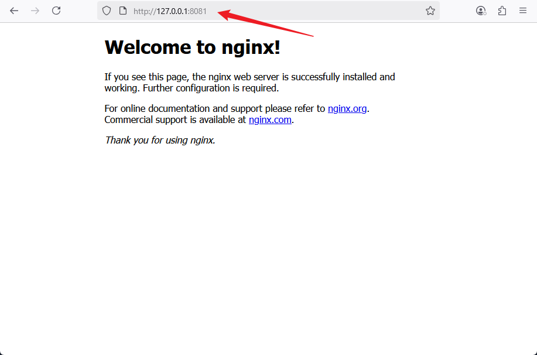

# 🚀 Helm Chart Customization — NGINX Web App

This project demonstrates how to deploy an NGINX web server to a Kubernetes cluster using Helm. It includes customizing a Helm chart, configuring resources, and deploying the application.


## 📦 Project Overview

In this project, you will:

- Understand Helm charts, values, and templates
- Customize a Helm chart to deploy NGINX
- Set static CPU and memory resource limits
- Deploy the application and access it locally
- Push your configuration to GitHub

## 🧰 Prerequisites

Ensure you have the following:

- Helm
- `kubectl`
- A running Kubernetes cluster (Minikube, Docker Desktop, or cloud)
- Git
- Docker (installed locally)
- VS Code or any code editor

## 📁 Project Structure

```

helm-web-app-2/
├── webapp/
│   ├── Chart.yaml
│   ├── values.yaml
│   └── templates/
│       └── deployment.yaml

```

## 🛠️Task 1: Helm Chart Customization

### Step 1: Create a new project directory:

```bash
mkdir helm-web-app-2
cd helm-web-app-2
```
**Screenshot:**


### Step 2: Create the Chart

```bash
helm create webapp
```
**Screenshot:**


### Step 3: Edit `values.yaml`

Edit values.yaml and update the following values:

```yaml
replicaCount: 2

image:
  repository: nginx
  tag: stable
  pullPolicy: IfNotPresent
```
**Screenshot:**


### Step 4: Edit `deployment.yaml`

Replace resource section with:

```yaml
resources:
  requests:
    memory: "128Mi"
    cpu: "100m"
  limits:
    memory: "256Mi"
    cpu: "200m"
```

Remove any line like `{{- toYaml .Values.resources | nindent 12 }}` if present.
**Screenshot:**


## 🛠️ Task 2: Install Minikube with Hyper-V

### ✅ Step 1: Confirm Hyper-V is Enabled

Open PowerShell as Administrator and run:

```powershell
Get-WindowsOptionalFeature -Online -FeatureName Microsoft-Hyper-V-All
```
**Screenshot:**


If it shows **Enabled**, you’re good.

If not, enable it with:

```powershell
Enable-WindowsOptionalFeature -Online -FeatureName Microsoft-Hyper-V -All
```
**Screenshot:**


Then **restart your system**.

### ✅ Step 2: Create a Hyper-V Virtual Switch

- 🔧 This is required for networking inside the VM.

#### 📍 How to create a virtual switch:

1. Open **Hyper-V Manager**

   * Press `Windows + S`, search **"Hyper-V Manager"**, and open it.
2. On the right side, click **“Virtual Switch Manager”**
3. Select **“New virtual network switch”**
4. Choose **“External”**, then click **Create Virtual Switch**
5. Name it something like: `MinikubeSwitch`
6. Select your active internet adapter (e.g. Wi-Fi or Ethernet)
7. Click **Apply** and then **OK**

**Screenshot:**


### ✅ Step 3: Start Minikube with Hyper-V

Now open **Git Bash or PowerShell** and run:

```bash
minikube start --driver=hyperv --hyperv-virtual-switch="MinikubeSwitch"
```

- Replace `"MinikubeSwitch"` with the exact name you used.

This will:

* Download the Minikube image
* Create the VM using Hyper-V
* Start a Kubernetes cluster inside the VM
**Screenshot:**


### ✅ Step 4: Verify Your Kubernetes Cluster

After it finishes, run:

```bash
kubectl config use-context minikube
kubectl cluster-info
```

Expected output:

```
Kubernetes control plane is running at https://...
```
**Screenshot:**


## 🚀Task 3: Deployment

### Step 1: Install with Helm

```bash
helm install my-webapp ./webapp
```
**Screenshot:**


### Step 2: Check Status

```bash
kubectl get deployments
kubectl get pods
```

**Screenshot:**


### Step 3: Port Forward & Access App

```bash
# Get the pod name for your Helm release and app label
export POD_NAME=$(kubectl get pods -l "app.kubernetes.io/name=webapp,app.kubernetes.io/instance=my-webapp" -o jsonpath="{.items[0].metadata.name}")

# Get the container port exposed in the pod spec
export CONTAINER_PORT=$(kubectl get pod $POD_NAME -o jsonpath="{.spec.containers[0].ports[0].containerPort}")

# Forward the pod port to localhost port 8081
kubectl port-forward $POD_NAME 8081:$CONTAINER_PORT
```

**Screenshot:**


Open your browser:

```
http://127.0.0.1:8081
```

**Screenshot:**


## 🗃️ Task 4: Git Staging, Committing, and Pushing Code to GitHub
### Step 1: Stage and Commit the Template to Git
In this step, I will add the website files to the Git repository, configure my global Git settings, and make an initial commit with a descriptive message.
- Add Files: Add all website files to the staging area.
- Configure Git User Information: Set up global configuration with my actual git username and email address.
- Commit Changes: Commit the changes with a clear and descriptive message.
__Commands:__
```bash
git init
git add .
git config --global user.name "holuphilix"
git config --global user.email "oluphilix@gmail.com"
git commit -m "Customize Helm chart with NGINX and static resource limits"
```
**Screenshot:**

### Step 2: Push the code to your Github repository
After initializing your Git repository and adding your WordPress site template, the next step is to push your code to a remote repository on GitHub. This step is crucial for version control and collaboration.
- Create a Remote Repository on GitHub: Log into your GitHub account and create a new repository named __helm-web-app-2__. Leave the repository empty without initializing it with a README, .gitignore, or license.
**Screenshot 1:**

**Screenshot 2:**

- Link Your Local Repository to GitHub: In your terminal, within your project directory, add the remote repository URL to your local repository configuration.
- Push Your Code: Upload Your Local Repository Content to GitHub Once you have linked your local repository to GitHub, use the following command to push your commits from your local main branch to the remote repository. This enables you to store your project in the cloud and share it with others.
__Commands:__
```bash
git remote add origin https://github.com/Holuphilix/-helm-web-app-2.git
git branch -M main
git push -u origin main
```
**Screenshot:**


## 🎯 Conclusion

In this project, you successfully deployed an NGINX web server to a Kubernetes cluster using Helm charts. You learned how to:

- Customize Helm charts by editing values.yaml and template files,

- Set resource requests and limits to optimize container performance,

- Use Minikube with Hyper-V to run a local Kubernetes cluster,

- Deploy your Helm chart and verify running resources,

- Access your application locally via port forwarding,

- Initialize a Git repository and push your project to GitHub for version control and collaboration.

This project demonstrates the power of Helm for Kubernetes application management and how infrastructure-as-code practices can streamline application deployment workflows.

You are now equipped with a foundational skill set to create, customize, deploy, and manage applications on Kubernetes using Helm. These skills can be extended to more complex applications and production environments, paving the way for scalable and maintainable cloud-native deployments.

## Author
**Philip Oluwaseyi Oludolamu**
DevOps Engineer 

* ✉️ Email: [oluphilix@gmail.com](mailto:oluphilix@gmail.com)
* 🔗 LinkedIn: [linkedin.com/in/philipoludolamu](https://www.linkedin.com/in/philipoludolamu)

*Completed on July 01, 2025*
